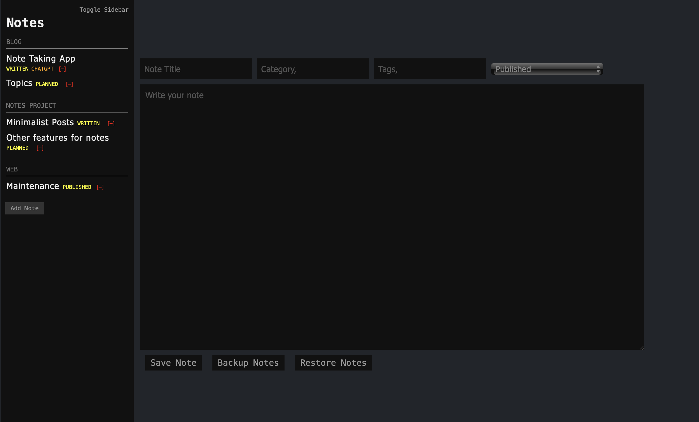

# Minimalist Notes

## Overview

A simple note-taking application built with HTML, CSS, and JavaScript that
allows users to add, organize, and manage notes.

The HTML is written in a really simple way, so you can create your own Status
messages for the toggle bar, and Categories are automatically generated when you
type one, automatically deleting the categories when you delete all notes
related to it.

## Pic

## Features

- Add and edit notes
- Categories
- Tags
- Backup and restore notes
- Sidebar toggle
- Autosave

## Installation

1. Clone the repository or download the files.
2. Open `index.html` in your web browser.

## Usage

1. Use the input fields to add a title, category, tags and content to your note.
2. Save your note using the "Save Note" button.
3. View and delete notes by category in the sidebar.

## Acknowledgements

This project was developed with the assistance of ChatGPT, an AI language model
developed by OpenAI. ChatGPT did all the javascript code, and I did the structure
and design code. We argued. We solved problems.

## Please Note

This is a very simple note system, so a few things to consider and remember:
- If you create a note of the same name as an existing note, it will overwrite
the existing one with your ned content.
- If you write a bunch of stuff and don't hit save and refresh, it will
overwrite the note with a blank page.
- Because the notes are locally stored in your browser, you need to periodically
create a backup to ensure that clearing your browser cache doesn't delete it
permanently.
- ChatGPT told me that it can keep between 5,000 and 10,000 notes without
breaking your computer.

## License
MIT License

Copyright (c) 2024 [Kat Tepelyan]

Permission is hereby granted, free of charge, to any person obtaining a copy
of this software and associated documentation files (the "Software"), to deal
in the Software without restriction, including without limitation the rights
to use, copy, modify, merge, publish, distribute, sublicense, and/or sell
copies of the Software, and to permit persons to whom the Software is
furnished to do so, subject to the following conditions:

The above copyright notice and this permission notice shall be included in all
copies or substantial portions of the Software.

THE SOFTWARE IS PROVIDED "AS IS", WITHOUT WARRANTY OF ANY KIND, EXPRESS OR
IMPLIED, INCLUDING BUT NOT LIMITED TO THE WARRANTIES OF MERCHANTABILITY,
FITNESS FOR A PARTICULAR PURPOSE AND NONINFRINGEMENT. IN NO EVENT SHALL THE
AUTHORS OR COPYRIGHT HOLDERS BE LIABLE FOR ANY CLAIM, DAMAGES OR OTHER
LIABILITY, WHETHER IN AN ACTION OF CONTRACT, TORT OR OTHERWISE, ARISING FROM,
OUT OF OR IN CONNECTION WITH THE SOFTWARE OR THE USE OR OTHER DEALINGS IN
THE SOFTWARE.

Authors: Kat Tepelyan and ChatGPT
